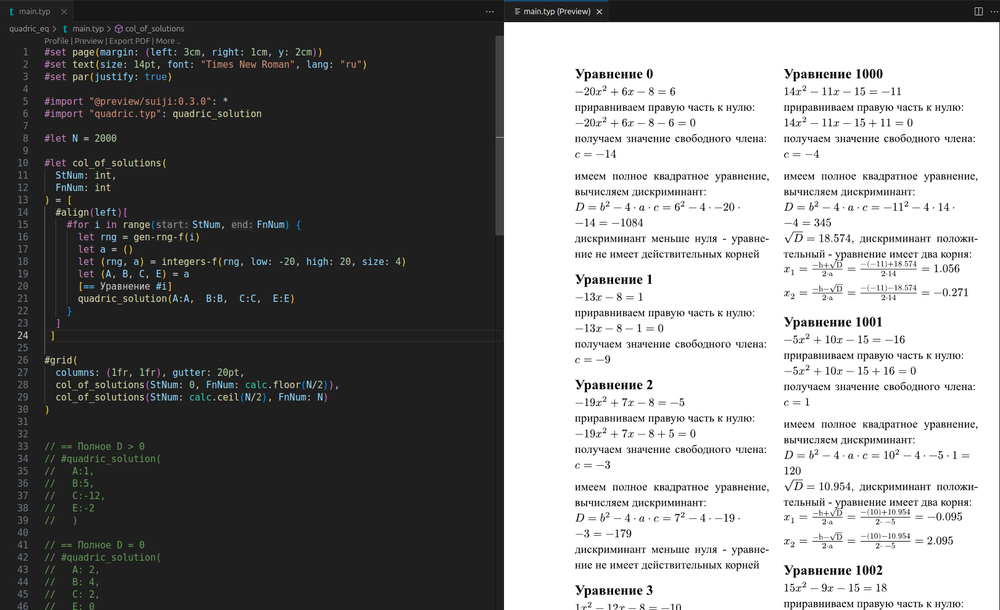

* Документация typst:
https://typst.app/docs/

* Установка typst:
https://lindevs.com/install-typst-on-ubuntu

* Вселенная typst(Б-А-Т-А-Р-Е-Й-К-И):
https://typst.app/universe/

* HotReload viewer для VS Code:
https://marketplace.visualstudio.com/items?itemName=myriad-dreamin.tinymist

* Cool Math Mode Tutorial
https://sitandr.github.io/typst-examples-book/book/about.html

----

* Компиляции документа:

$ typst compile main.typ quadric.pdf

----

Результаты для случайных 2000 уравнений:

